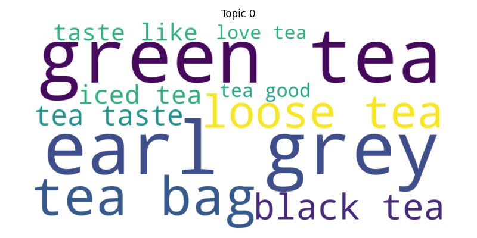
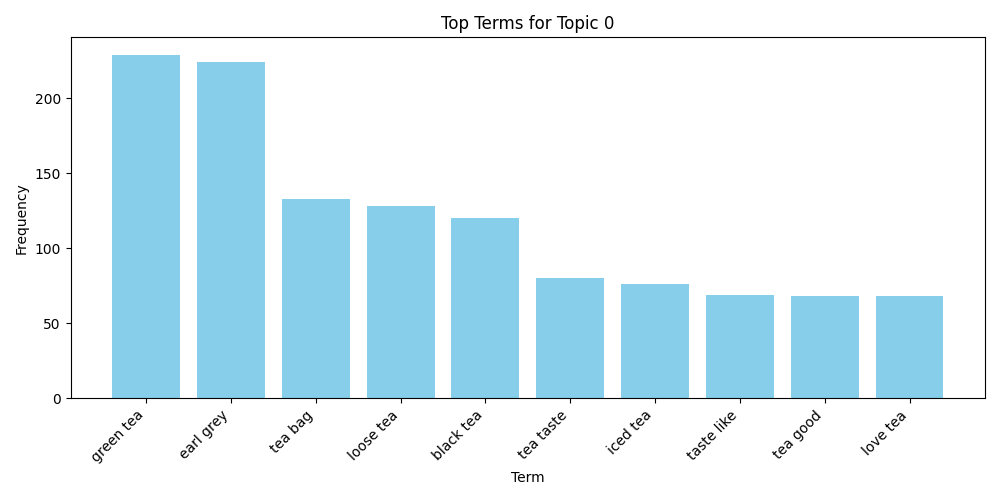

# 🧠 AI-Powered Product Review Intelligence & Roadmapping

This project analyzes 10,000+ Amazon product reviews using advanced NLP techniques to uncover top product features, user sentiment, and actionable insights. It combines topic modeling, n-gram phrase extraction, sentiment scoring, and a feature prioritization matrix to help product teams align roadmaps with customer needs.

---

## 🔍 Project Highlights

- **Topic Modeling:** Identifies latent topics from customer reviews using LDA.
- **Bigram/Trigram Extraction:** Surfaces high-impact phrases per topic with frequency analysis.
- **Sentiment Analysis:** Measures average sentiment of topics using VADER.
- **Prioritization Matrix:** Maps topics on frequency vs. sentiment to aid product decision-making.
- **Visual Reports:** Auto-generates word clouds, bar charts, and a prioritization bubble matrix.

---

## 📁 Directory Structure
📦amazon-review-intelligence
┣ 📂data/
┃ ┗ analyzed_reviews.pkl         # Preprocessed and labeled reviews with sentiment & topics
┣ 📂visualizations/
┃ ┣ topic_{n}wordcloud.png     # Word cloud of top n-grams for each topic
┃ ┣ topic{n}_bar_chart.png     # Bar chart of phrase frequency
┃ ┗ prioritization_matrix.png   # Bubble chart: frequency vs. sentiment
┣ analyze.py                     # Orchestrates NLP + visualization pipeline
┣ extract_topic_phrases.py      # Extracts top n-grams (bi/trigrams) per topic
┣ inspect_top_topics.py         # Drill-down on specific topic reviews
┣ nlp_pipeline.py               # NLP pipeline: cleaning, LDA, VADER, lemmatization
┣ priority_matrix.py            # Builds prioritization matrix of features
┣ requirements.txt              # Project dependencies
┗ README.md                     # Project overview and instructions

---

## ⚙️ How to Run

1. **Install Dependencies**

bash
```pip install -r requirements.txt```

Dependencies listed in requirements.txt:
pandas
numpy
nltk
matplotlib
seaborn
wordcloud
scikit-learn
gensim
spacy
textblob
pyLDAvis

---

2.	Download NLP Assets
python -m nltk.downloader vader_lexicon stopwords
python -m spacy download en_core_web_sm

---

4.	Run the End-to-End Pipeline
python analyze.py

This will generate:
	•	Cleaned reviews with sentiment and topic labels
	•	Bigram/trigram word clouds and bar charts per topic
	•	Final prioritization matrix in visualizations/

---

📊 Sample Output

✅ Top Phrases per Topic
	•	Topic 0 (Tea Lovers): green tea, earl grey, tea bag, loose tea
	•	Topic 1 (Fruit Flavors): fruit juice, kiwi berry, taste like
	•	Topic 2 (Baby Food): baby food, month old, sweet potato
	•	(and more…)


🎯 Prioritization Matrix
	•	X-axis: Number of reviews (feature frequency)
	•	Y-axis: Average sentiment score
	•	Each bubble = one topic, size = volume

Helps identify:
	•	🔼 High-frequency, high-sentiment: Build on these
	•	🔽 High-frequency, low-sentiment: Prioritize fixes
	•	🎯 Low-frequency, high-sentiment: Investigate further

🤖 Techniques Used
	•	NLP Libraries: spaCy, NLTK, Gensim, Scikit-learn
	•	Topic Modeling: LDA (Latent Dirichlet Allocation)
	•	Sentiment Analysis: VADER (Valence Aware Dictionary)
	•	Phrase Extraction: CountVectorizer (n-gram features)
	•	Visualization: Matplotlib, WordCloud, Seaborn

🧠 Use Cases
	•	Feature request mining from reviews
	•	Product roadmap prioritization
	•	Customer sentiment tracking
	•	Voice of Customer (VoC) dashboards

---

📊 Output Visuals

🔵 Prioritization Matrix:
	•	X-axis: Frequency of feature/topic across reviews
	•	Y-axis: Average sentiment score for that feature/topic
	•	Quadrants:
	•	📈 Top-right (🔥 Prioritize): High frequency, high sentiment
	•	💤 Bottom-left: Low frequency, low sentiment
	•	😐 Top-left: Low frequency, high sentiment
	•	📉 Bottom-right: High frequency, low sentiment


---

🔠 Topic Bar Charts and Wordclouds:
Topic 0: Tea-related Phrases
• Common Phrases: green tea, earl grey, tea bag, loose tea




Topic 1: Fruit Juices
• Common Phrases: fruit juice, kiwi berry, orange tangerine


Topic 2: Baby Food
• Common Phrases: baby food, month old, earth good


Topic 3: Hot Chocolate
• Common Phrases: hot chocolate, hot cocoa, dark chocolate


Topic 4: Cat Food
• Common Phrases: cat food, cat love, cat eat


---
📬 Contact

Built with ❤️ by RIJUL CHATURVEDI
📧 Email: richatur@syr.edu
🔗 LinkedIn: https://www.linkedin.com/in/rijul-chaturvedi
